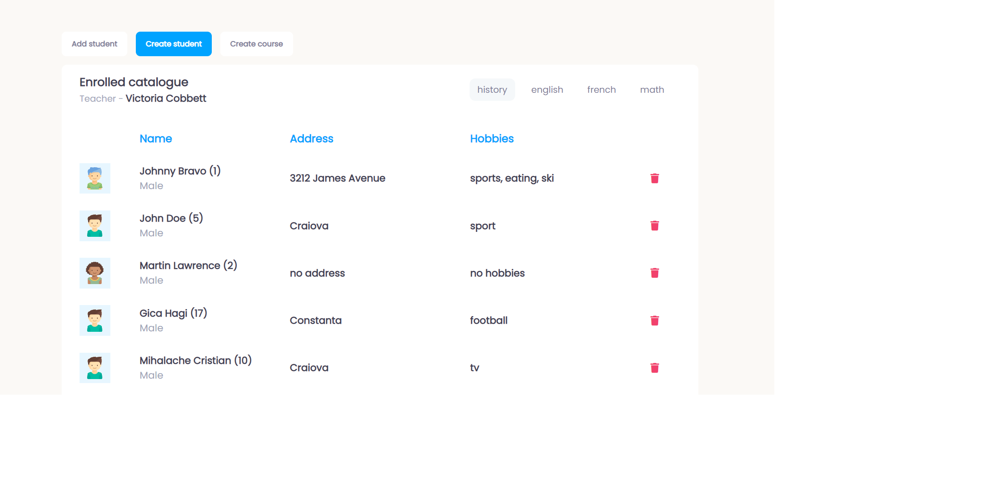
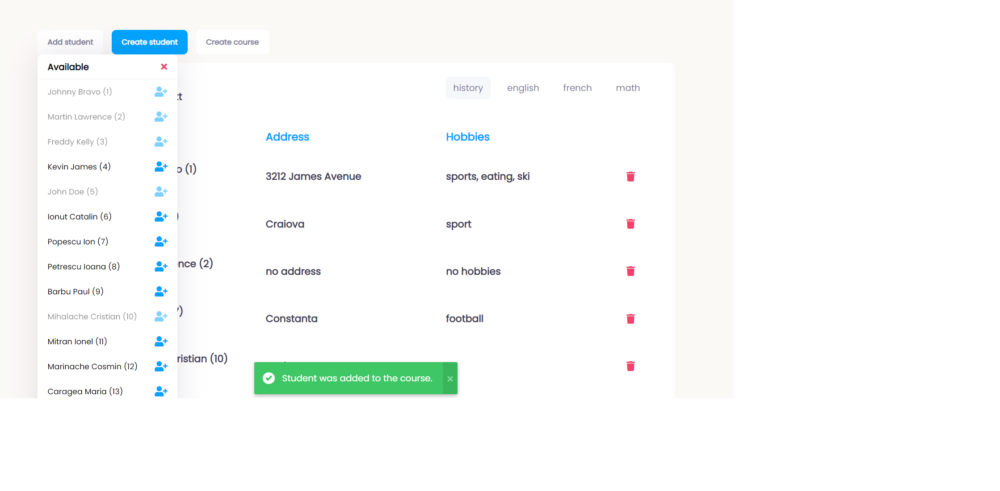
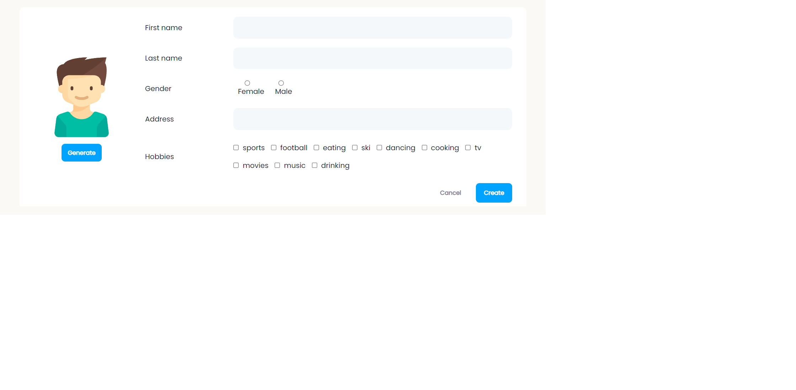
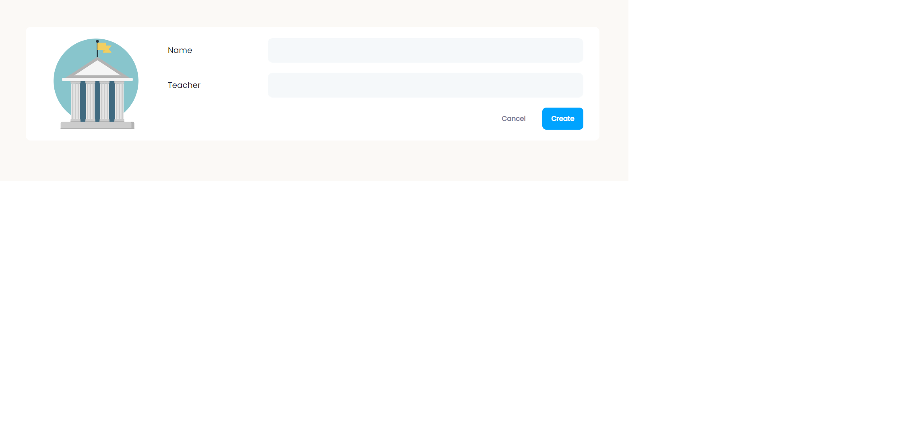

# Dom-manipulation-student-management - developed in Vanilla Javascript.

## Available Scripts

In the project directory, you can run:

### `1. Run Json-Server Database`

json-server --watch db.json

### `2. Open the application`

Open only with Live-Server, it will run the app on [http://localhost:3000](http://localhost:3000) in the browser.

## Print-Screens

